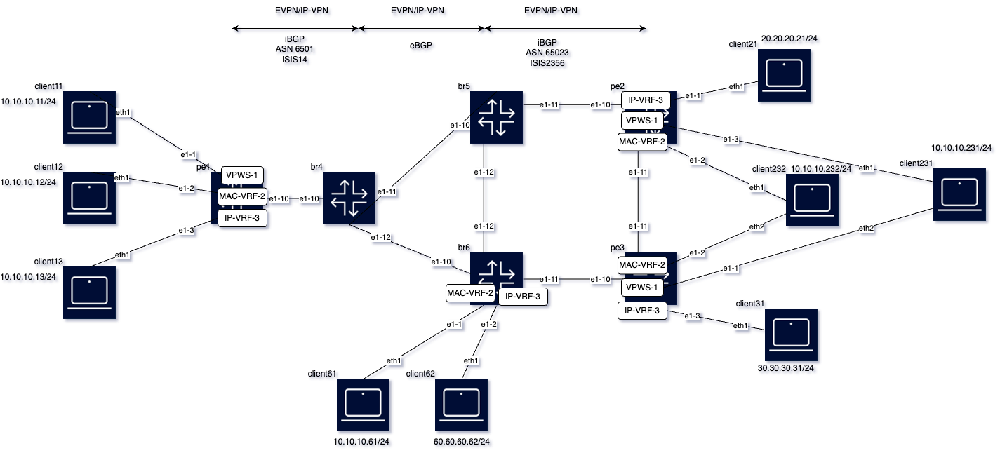

# Inter-AS Option B EVPN/IP-VPN services lab

This example shows EVPN and IPVPN services on Inter-AS option B scenarios.



The diagram shows two different Autonomous Systems (ASes) that are connected via border routers br4, br5 and br6, which are acting as Inter-AS model B ASBRs.
This model allows the operator to extend EVPN and IP-VPN services across different MPLS or Segment Routing MPLS domains, without the need for instantiating services on the border routers. Egress PEs advertise EVPN/IP-VPN routes to the adjacent border routers, and the border routers carry out two functions:

1. Import the routes and, if valid, redistribute the routes to the remote border routers or local PEs, using their own address as next hop and their own locally allocated service mpls labels.
2. Program a label swap operation so that ingress traffic service label is looked up and packets forwarded with a new service label that was previously received from the PE in the local domain.

## Configuration of the default network-instance in PEs and Border Routers

The following output shows the configuration of pe1's default network-instance. ISIS is used as IGP in each of the two domains. Transport tunnels are of type LDP and SR-ISIS. And BGP neighbor br4 is configured for the exchange of EVPN and IP-VPN routes.

<pre>
--{ + candidate shared default }--[ network-instance default ]--
A:pe1# info
    type default
    interface ethernet-1/10.0 {
    }
    interface system0.0 {
    }
    protocols {
        bgp {
            admin-state enable
            autonomous-system 65001
            router-id 100.0.0.1
            bgp-label {
                bgp-ipvpn {
                    next-hop-resolution {
                        ipv4-next-hops {
                            tunnel-resolution {
                                allowed-tunnel-types [
                                    ldp
                                    sr-isis
                                ]
                            }
                        }
                    }
                }
            }
            ebgp-default-policy {
                import-reject-all false
                export-reject-all false
            }
            afi-safi evpn {
                admin-state enable
                evpn {
                    keep-all-routes true
                    rapid-update true
                }
            }
            afi-safi l3vpn-ipv4-unicast {
                admin-state enable
                l3vpn-ipv4-unicast {
                    keep-all-routes true
                    rapid-update true
                }
            }
            group overlay-ibgp {
                peer-as 65001
                afi-safi evpn {
                }
                afi-safi l3vpn-ipv4-unicast {
                }
                timers {
                    connect-retry 1
                    minimum-advertisement-interval 1
                }
                trace-options {
                    flag update {
                        modifier detail
                    }
                }
            }
            neighbor 100.0.0.4 {
                peer-group overlay-ibgp
            }
        }
        ldp {
            admin-state enable
            dynamic-label-block range-1-ldp
            discovery {
                interfaces {
                    interface ethernet-1/10.0 {
                        ipv4 {
                            admin-state enable
                        }
                    }
                }
            }
        }
        isis {
            dynamic-label-block range-3-srgb
            instance i14 {
                admin-state enable
                instance-id 1
                level-capability L2
                iid-tlv true
                net [
                    49.0001.0000.0000.0001.00
                ]
                trace-options {
                    trace [
                        adjacencies
                        interfaces
                        packets-all
                    ]
                }
                segment-routing {
                    mpls {
                        dynamic-adjacency-sids {
                            all-interfaces true
                        }
                    }
                }
                interface ethernet-1/10.0 {
                    circuit-type point-to-point
                    ipv4-unicast {
                        admin-state enable
                    }
                }
                interface system0.0 {
                    passive true
                    ipv4-unicast {
                        admin-state enable
                    }
                }
            }
        }
    }
    segment-routing {
        mpls {
            global-block {
                label-range range-2-srgb
            }
            local-prefix-sid 1 {
                interface system0.0
                ipv4-label-index 1
            }
        }
    }
--{ + candidate shared default }--[ network-instance default ]--
</pre>

Similar configurations exist on the other PEs, with the exception that pe2 is configured as a route reflector on its own domain. The configuration of the default network-instance on pe2 follows.

<pre>
--{ + candidate shared default }--[ network-instance default protocols bgp ]--
A:pe2# info
    admin-state enable
    autonomous-system 65023
    router-id 100.0.0.2
    bgp-label {
        bgp-ipvpn {
            next-hop-resolution {
                ipv4-next-hops {
                    tunnel-resolution {
                        allowed-tunnel-types [
                            ldp
                            sr-isis
                        ]
                    }
                }
            }
        }
    }
    ebgp-default-policy {
        import-reject-all false
        export-reject-all false
    }
    afi-safi evpn {
        admin-state enable
        evpn {
            keep-all-routes true
            rapid-update true
        }
    }
    afi-safi l3vpn-ipv4-unicast {
        admin-state enable
        l3vpn-ipv4-unicast {
            keep-all-routes true
            rapid-update true
        }
    }
    group overlay-ibgp {
        peer-as 65023
        afi-safi evpn {
        }
        afi-safi l3vpn-ipv4-unicast {
        }
        route-reflector {
            client true
            cluster-id 2.2.2.2
        }
        timers {
            connect-retry 1
            minimum-advertisement-interval 1
        }
        trace-options {
            flag update {
                modifier detail
            }
        }
    }
    neighbor 100.0.0.3 {
        peer-group overlay-ibgp
    }
    neighbor 100.0.0.5 {
        peer-group overlay-ibgp
    }
    neighbor 100.0.0.6 {
        peer-group overlay-ibgp
    }
</pre>

The border routers are configured in a similar way, only that the IGP is not enabled in their interfaces to other border routers. In addition, border routers configured for inter-as option B, need the following two things:

1. The configuration of the label block that the border router, as ASBR, will use to draw EVPN/IP-VPN labels for the service label swap operation. This is configured using the command `protocols.bgp.bgp-label.bgp-vpn.dynamic-label-block <label-block>`.
2. The configuration of `inter-as-vpn true` command for EVPN and IP-VPN, which triggers the router to keep the received EVPN/IP-VPN routes (even without a network-instance that imports the routes) and redistribute them to the adjacent ASN with a next hop and label change.

As an example, br4's configuration of the default network instance follows:

<pre>
--{ + candidate shared default }--[ network-instance default ]--
A:br4# info
    type default
    interface ethernet-1/10.0 {
    }
    interface ethernet-1/11.0 {
    }
    interface ethernet-1/12.0 {
    }
    interface system0.0 {
    }
    protocols {
        bgp {
            autonomous-system 65001
            router-id 100.0.0.4
            bgp-label {
                bgp-vpn {
                    dynamic-label-block range-6-bgp-lu
                }
                bgp-ipvpn {
                    next-hop-resolution {
                        ipv4-next-hops {
                            tunnel-resolution {
                                allowed-tunnel-types [
                                    ldp
                                    sr-isis
                                ]
                            }
                        }
                    }
                }
            }
            ebgp-default-policy {
                import-reject-all false
                export-reject-all false
            }
            afi-safi evpn {
                admin-state enable
                evpn {
                    inter-as-vpn true
                    rapid-update true
                    default-received-encapsulation mpls
                    next-hop-resolution {
                        ipv4-next-hops {
                            tunnel-resolution {
                                allowed-tunnel-types [
                                    bgp
                                    ldp
                                    sr-isis
                                ]
                            }
                        }
                    }
                }
            }
            afi-safi l3vpn-ipv4-unicast {
                admin-state enable
                l3vpn-ipv4-unicast {
                    inter-as-vpn true
                    rapid-update true
                }
            }
            group overlay-ebgp {
                peer-as 65023
                afi-safi evpn {
                }
                timers {
                    connect-retry 1
                    minimum-advertisement-interval 1
                }
                trace-options {
                    flag update {
                        modifier detail
                    }
                }
            }
            group overlay-ibgp {
                peer-as 65001
                afi-safi evpn {
                }
                timers {
                    connect-retry 1
                    minimum-advertisement-interval 1
                }
                trace-options {
                    flag update {
                        modifier detail
                    }
                }
            }
            neighbor 10.4.5.2 {
                peer-group overlay-ebgp
            }
            neighbor 10.4.6.2 {
                peer-group overlay-ebgp
            }
            neighbor 100.0.0.1 {
                peer-group overlay-ibgp
            }
        }
        ldp {
            admin-state enable
            dynamic-label-block range-1-ldp
            discovery {
                interfaces {
                    interface ethernet-1/10.0 {
                        ipv4 {
                            admin-state enable
                        }
                    }
                    interface ethernet-1/11.0 {
                        ipv4 {
                            admin-state enable
                        }
                    }
                    interface ethernet-1/12.0 {
                        ipv4 {
                            admin-state enable
                        }
                    }
                }
            }
        }
        isis {
            dynamic-label-block range-3-srgb
            instance i14 {
                admin-state enable
                instance-id 1
                level-capability L2
                iid-tlv true
                net [
                    49.0001.0000.0000.0004.00
                ]
                segment-routing {
                    mpls {
                        dynamic-adjacency-sids {
                            all-interfaces true
                        }
                    }
                }
                interface ethernet-1/10.0 {
                    circuit-type point-to-point
                    ipv4-unicast {
                        admin-state enable
                    }
                }
                interface system0.0 {
                    passive true
                    ipv4-unicast {
                        admin-state enable
                    }
                }
            }
        }
    }
    segment-routing {
        mpls {
            global-block {
                label-range range-2-srgb
            }
            local-prefix-sid 1 {
                interface system0.0
                ipv4-label-index 4
            }
        }
    }
--{ + candidate shared default }--[ network-instance default ]--
</pre>

And br4's label allocation for transport and services is configured as follows:

<pre>
--{ + candidate shared default }--[ system mpls ]--
A:br4# info
    label-ranges {
        static range-2-srgb {
            shared true
            start-label 100001
            end-label 120000
        }
        static range-5-static-services {
            shared false
            start-label 3000
            end-label 4000
        }
        dynamic range-1-ldp {
            start-label 100
            end-label 200
        }
        dynamic range-3-srgb {
            start-label 120001
            end-label 120999
        }
        dynamic range-4-evpn {
            start-label 500
            end-label 699
        }
        dynamic range-5-services {
            start-label 1000
            end-label 2000
        }
        dynamic range-6-bgp-lu {
            start-label 122001
            end-label 122201
        }
    }
    services {
        evpn {
            dynamic-label-block range-4-evpn
        }
        network-instance {
            dynamic-label-block range-5-services
        }
    }
</pre>

Similar configurations exist in the other border routers. The configuration of br6 follows:

<pre>
--{ + candidate shared default }--[ network-instance default ]--
A:br6# info
    type default
    interface ethernet-1/10.0 {
    }
    interface ethernet-1/11.0 {
    }
    interface ethernet-1/12.0 {
    }
    interface system0.0 {
    }
    protocols {
        bgp {
            autonomous-system 65023
            router-id 100.0.0.6
            bgp-label {
                bgp-vpn {
                    dynamic-label-block range-6-bgp-lu
                }
                bgp-ipvpn {
                    next-hop-resolution {
                        ipv4-next-hops {
                            tunnel-resolution {
                                allowed-tunnel-types [
                                    ldp
                                    sr-isis
                                ]
                            }
                        }
                    }
                }
            }
            ebgp-default-policy {
                import-reject-all false
                export-reject-all false
            }
            afi-safi evpn {
                admin-state enable
                evpn {
                    inter-as-vpn true
                    rapid-update true
                    default-received-encapsulation mpls
                    next-hop-resolution {
                        ipv4-next-hops {
                            tunnel-resolution {
                                allowed-tunnel-types [
                                    bgp
                                    ldp
                                    sr-isis
                                ]
                            }
                        }
                    }
                }
            }
            afi-safi l3vpn-ipv4-unicast {
                admin-state enable
                l3vpn-ipv4-unicast {
                    inter-as-vpn true
                    rapid-update true
                }
            }
            group overlay-ebgp {
                peer-as 65001
                afi-safi evpn {
                }
                timers {
                    connect-retry 1
                    minimum-advertisement-interval 1
                }
                trace-options {
                    flag update {
                        modifier detail
                    }
                }
            }
            group overlay-ibgp {
                peer-as 65023
                afi-safi evpn {
                }
                timers {
                    connect-retry 1
                    minimum-advertisement-interval 1
                }
                trace-options {
                    flag update {
                        modifier detail
                    }
                }
            }
            neighbor 10.4.6.1 {
                peer-group overlay-ebgp
            }
            neighbor 100.0.0.2 {
                peer-group overlay-ibgp
            }
        }
        ldp {
            admin-state enable
            dynamic-label-block range-1-ldp
            discovery {
                interfaces {
                    interface ethernet-1/10.0 {
                        ipv4 {
                            admin-state enable
                        }
                    }
                    interface ethernet-1/11.0 {
                        ipv4 {
                            admin-state enable
                        }
                    }
                    interface ethernet-1/12.0 {
                        ipv4 {
                            admin-state enable
                        }
                    }
                }
            }
        }
        isis {
            dynamic-label-block range-3-srgb
            instance i2356 {
                admin-state enable
                instance-id 3
                level-capability L2
                max-ecmp-paths 64
                iid-tlv true
                net [
                    49.0003.0000.0000.0006.00
                ]
                segment-routing {
                    mpls {
                        dynamic-adjacency-sids {
                            all-interfaces true
                        }
                    }
                }
                interface ethernet-1/11.0 {
                    circuit-type point-to-point
                    ipv4-unicast {
                        admin-state enable
                    }
                }
                interface ethernet-1/12.0 {
                    circuit-type point-to-point
                    ipv4-unicast {
                        admin-state enable
                    }
                }
                interface system0.0 {
                    passive true
                    ipv4-unicast {
                        admin-state enable
                    }
                }
            }
        }
    }
    segment-routing {
        mpls {
            global-block {
                label-range range-2-srgb
            }
            local-prefix-sid 1 {
                interface system0.0
                ipv4-label-index 6
            }
        }
    }
--{ + candidate shared default }--[ network-instance default ]--
</pre>

Once the default network-instance is configured on all the routers, reachability and the setup of tunnels can be checked as follows:

```bash
// route-table and tunnel-table in pe1

A:pe1# show route-table
--------------------------------------------------------------------------------------------------------------------------------------------------------------------------------------------------------------------------------------------------
IPv4 unicast route table of network instance default
--------------------------------------------------------------------------------------------------------------------------------------------------------------------------------------------------------------------------------------------------
+------------------------------------+-------+------------+----------------------+----------+----------+---------+------------+----------------------+----------------------+----------------------+---------------------------------------------+
|               Prefix               |  ID   | Route Type |     Route Owner      |  Active  |  Origin  | Metric  |    Pref    |   Next-hop (Type)    |  Next-hop Interface  |   Backup Next-hop    |          Backup Next-hop Interface          |
|                                    |       |            |                      |          | Network  |         |            |                      |                      |        (Type)        |                                             |
|                                    |       |            |                      |          | Instance |         |            |                      |                      |                      |                                             |
+====================================+=======+============+======================+==========+==========+=========+============+======================+======================+======================+=============================================+
| 10.1.4.0/30                        | 4     | local      | net_inst_mgr         | True     | default  | 0       | 0          | 10.1.4.1 (direct)    | ethernet-1/10.0      |                      |                                             |
| 10.1.4.1/32                        | 4     | host       | net_inst_mgr         | True     | default  | 0       | 0          | None (extract)       | None                 |                      |                                             |
| 10.1.4.3/32                        | 4     | host       | net_inst_mgr         | True     | default  | 0       | 0          | None (broadcast)     |                      |                      |                                             |
| 100.0.0.1/32                       | 6     | host       | net_inst_mgr         | True     | default  | 0       | 0          | None (extract)       | None                 |                      |                                             |
| 100.0.0.4/32                       | 1     | isis       | isis_mgr             | True     | default  | 10      | 18         | 10.1.4.2 (direct)    | ethernet-1/10.0      |                      |                                             |
+------------------------------------+-------+------------+----------------------+----------+----------+---------+------------+----------------------+----------------------+----------------------+---------------------------------------------+
--------------------------------------------------------------------------------------------------------------------------------------------------------------------------------------------------------------------------------------------------
IPv4 routes total                    : 5
IPv4 prefixes with active routes     : 5
IPv4 prefixes with active ECMP routes: 0
--------------------------------------------------------------------------------------------------------------------------------------------------------------------------------------------------------------------------------------------------
--{ + candidate shared default }--[ network-instance default ]--
A:pe1# show tunnel-table
--------------------------------------------------------------------------------------------------------------------------------------------------------------------------------------------------------------------------------------------------
IPv4 tunnel table of network-instance "default"
--------------------------------------------------------------------------------------------------------------------------------------------------------------------------------------------------------------------------------------------------
+---------------------------------------------+--------+----------------+----------+-----+----------+---------+--------------------------+---------------------------+---------------------------+
|                 IPv4 Prefix                 | Encaps |  Tunnel Type   |  Tunnel  | FIB |  Metric  | Prefere |       Last Update        |      Next-hop (Type)      |         Next-hop          |
|                                             |  Type  |                |    ID    |     |          |   nce   |                          |                           |                           |
+=============================================+========+================+==========+=====+==========+=========+==========================+===========================+===========================+
| 10.1.4.2/32                                 | mpls   | sr-isis        | 120001   | Y   | 0        | 11      | 2024-06-21T10:39:09.687Z | 10.1.4.2 (mpls)           | ethernet-1/10.0           |
| 100.0.0.4/32                                | mpls   | ldp            | 65537    | Y   | 10       | 9       | 2024-06-21T10:39:15.491Z | 10.1.4.2 (mpls)           | ethernet-1/10.0           |
| 100.0.0.4/32                                | mpls   | sr-isis        | 100005   | Y   | 10       | 11      | 2024-06-21T10:39:15.097Z | 10.1.4.2 (mpls)           | ethernet-1/10.0           |
+---------------------------------------------+--------+----------------+----------+-----+----------+---------+--------------------------+---------------------------+---------------------------+
--------------------------------------------------------------------------------------------------------------------------------------------------------------------------------------------------------------------------------------------------
2 SR-ISIS tunnels, 2 active, 0 inactive
1 LDP tunnels, 1 active, 0 inactive
--------------------------------------------------------------------------------------------------------------------------------------------------------------------------------------------------------------------------------------------------
--------------------------------------------------------------------------------------------------------------------------------------------------------------------------------------------------------------------------------------------------
IPv6 tunnel table of network-instance "default"
--------------------------------------------------------------------------------------------------------------------------------------------------------------------------------------------------------------------------------------------------
<no_entries>
--------------------------------------------------------------------------------------------------------------------------------------------------------------------------------------------------------------------------------------------------
--------------------------------------------------------------------------------------------------------------------------------------------------------------------------------------------------------------------------------------------------
--{ + candidate shared default }--[ network-instance default ]--

// route-table and tunnel-table in pe2

--{ + candidate shared default }--[ network-instance default ]--
A:pe2# show route-table
--------------------------------------------------------------------------------------------------------------------------------------------------------------------------------------------------------------------------------------------------------------
IPv4 unicast route table of network instance default
--------------------------------------------------------------------------------------------------------------------------------------------------------------------------------------------------------------------------------------------------------------
+---------------------------------------+-------+------------+----------------------+----------+----------+---------+------------+------------------------+------------------------+------------------------+------------------------------------------------+
|                Prefix                 |  ID   | Route Type |     Route Owner      |  Active  |  Origin  | Metric  |    Pref    |    Next-hop (Type)     |   Next-hop Interface   | Backup Next-hop (Type) |           Backup Next-hop Interface            |
|                                       |       |            |                      |          | Network  |         |            |                        |                        |                        |                                                |
|                                       |       |            |                      |          | Instance |         |            |                        |                        |                        |                                                |
+=======================================+=======+============+======================+==========+==========+=========+============+========================+========================+========================+================================================+
| 10.2.3.0/30                           | 5     | local      | net_inst_mgr         | True     | default  | 0       | 0          | 10.2.3.1 (direct)      | ethernet-1/11.0        |                        |                                                |
| 10.2.3.1/32                           | 5     | host       | net_inst_mgr         | True     | default  | 0       | 0          | None (extract)         | None                   |                        |                                                |
| 10.2.3.3/32                           | 5     | host       | net_inst_mgr         | True     | default  | 0       | 0          | None (broadcast)       |                        |                        |                                                |
| 10.2.5.0/30                           | 4     | local      | net_inst_mgr         | True     | default  | 0       | 0          | 10.2.5.1 (direct)      | ethernet-1/10.0        |                        |                                                |
| 10.2.5.1/32                           | 4     | host       | net_inst_mgr         | True     | default  | 0       | 0          | None (extract)         | None                   |                        |                                                |
| 10.2.5.3/32                           | 4     | host       | net_inst_mgr         | True     | default  | 0       | 0          | None (broadcast)       |                        |                        |                                                |
| 10.3.6.0/30                           | 3     | isis       | isis_mgr             | True     | default  | 20      | 18         | 10.2.3.2 (direct)      | ethernet-1/11.0        |                        |                                                |
| 10.5.6.0/30                           | 3     | isis       | isis_mgr             | True     | default  | 20      | 18         | 10.2.5.2 (direct)      | ethernet-1/10.0        |                        |                                                |
| 100.0.0.2/32                          | 7     | host       | net_inst_mgr         | True     | default  | 0       | 0          | None (extract)         | None                   |                        |                                                |
| 100.0.0.3/32                          | 3     | isis       | isis_mgr             | True     | default  | 10      | 18         | 10.2.3.2 (direct)      | ethernet-1/11.0        |                        |                                                |
| 100.0.0.5/32                          | 3     | isis       | isis_mgr             | True     | default  | 10      | 18         | 10.2.5.2 (direct)      | ethernet-1/10.0        |                        |                                                |
| 100.0.0.6/32                          | 3     | isis       | isis_mgr             | True     | default  | 20      | 18         | 10.2.3.2 (direct)      | ethernet-1/11.0        |                        |                                                |
|                                       |       |            |                      |          |          |         |            | 10.2.5.2 (direct)      | ethernet-1/10.0        |                        |                                                |
+---------------------------------------+-------+------------+----------------------+----------+----------+---------+------------+------------------------+------------------------+------------------------+------------------------------------------------+
--------------------------------------------------------------------------------------------------------------------------------------------------------------------------------------------------------------------------------------------------------------
IPv4 routes total                    : 12
IPv4 prefixes with active routes     : 12
IPv4 prefixes with active ECMP routes: 1
--------------------------------------------------------------------------------------------------------------------------------------------------------------------------------------------------------------------------------------------------------------
--{ + candidate shared default }--[ network-instance default ]--
A:pe2# show tunnel-table
--------------------------------------------------------------------------------------------------------------------------------------------------------------------------------------------------------------------------------------------------------------
IPv4 tunnel table of network-instance "default"
--------------------------------------------------------------------------------------------------------------------------------------------------------------------------------------------------------------------------------------------------------------
+------------------------------------------------+--------+----------------+----------+-----+----------+---------+--------------------------+-----------------------------+-----------------------------+
|                  IPv4 Prefix                   | Encaps |  Tunnel Type   |  Tunnel  | FIB |  Metric  | Prefere |       Last Update        |       Next-hop (Type)       |          Next-hop           |
|                                                |  Type  |                |    ID    |     |          |   nce   |                          |                             |                             |
+================================================+========+================+==========+=====+==========+=========+==========================+=============================+=============================+
| 10.2.3.2/32                                    | mpls   | sr-isis        | 120001   | Y   | 0        | 11      | 2024-06-21T10:39:09.125Z | 10.2.3.2 (mpls)             | ethernet-1/11.0             |
| 10.2.5.2/32                                    | mpls   | sr-isis        | 120002   | Y   | 0        | 11      | 2024-06-21T10:39:09.895Z | 10.2.5.2 (mpls)             | ethernet-1/10.0             |
| 100.0.0.3/32                                   | mpls   | ldp            | 65537    | Y   | 10       | 9       | 2024-06-21T10:39:11.546Z | 10.2.3.2 (mpls)             | ethernet-1/11.0             |
| 100.0.0.3/32                                   | mpls   | sr-isis        | 100004   | Y   | 10       | 11      | 2024-06-21T10:39:10.769Z | 10.2.3.2 (mpls)             | ethernet-1/11.0             |
| 100.0.0.5/32                                   | mpls   | ldp            | 65538    | Y   | 10       | 9       | 2024-06-21T10:39:11.977Z | 10.2.5.2 (mpls)             | ethernet-1/10.0             |
| 100.0.0.5/32                                   | mpls   | sr-isis        | 100006   | Y   | 10       | 11      | 2024-06-21T10:39:10.769Z | 10.2.5.2 (mpls)             | ethernet-1/10.0             |
| 100.0.0.6/32                                   | mpls   | ldp            | 65539    | Y   | 20       | 9       | 2024-06-21T10:39:13.315Z | 10.2.3.2 (mpls)             | ethernet-1/11.0             |
| 100.0.0.6/32                                   | mpls   | sr-isis        | 100007   | Y   | 20       | 11      | 2024-06-21T10:39:10.769Z | 10.2.3.2 (mpls)             | ethernet-1/11.0             |
|                                                |        |                |          |     |          |         |                          | 10.2.5.2 (mpls)             | ethernet-1/10.0             |
+------------------------------------------------+--------+----------------+----------+-----+----------+---------+--------------------------+-----------------------------+-----------------------------+
--------------------------------------------------------------------------------------------------------------------------------------------------------------------------------------------------------------------------------------------------------------
5 SR-ISIS tunnels, 5 active, 0 inactive
3 LDP tunnels, 3 active, 0 inactive
--------------------------------------------------------------------------------------------------------------------------------------------------------------------------------------------------------------------------------------------------------------
--------------------------------------------------------------------------------------------------------------------------------------------------------------------------------------------------------------------------------------------------------------
IPv6 tunnel table of network-instance "default"
--------------------------------------------------------------------------------------------------------------------------------------------------------------------------------------------------------------------------------------------------------------
<no_entries>
--------------------------------------------------------------------------------------------------------------------------------------------------------------------------------------------------------------------------------------------------------------
--------------------------------------------------------------------------------------------------------------------------------------------------------------------------------------------------------------------------------------------------------------
--{ + candidate shared default }--[ network-instance default ]--
A:pe2#

```
In addition, the following outputs show that the BGP sessions for EVPN and IP-VPN families are established.

```bash
// BGP neighbors on pe1
--{ + candidate shared default }--[ network-instance default ]--
A:pe1# show protocols bgp neighbor
--------------------------------------------------------------------------------------------------------------------------------------------------------------------------------------------------------------------------------------------------
BGP neighbor summary for network-instance "default"
Flags: S static, D dynamic, L discovered by LLDP, B BFD enabled, - disabled, * slow
--------------------------------------------------------------------------------------------------------------------------------------------------------------------------------------------------------------------------------------------------
--------------------------------------------------------------------------------------------------------------------------------------------------------------------------------------------------------------------------------------------------
+--------------------------+--------------------------------------+--------------------------+---------+--------------+---------------------+---------------------+------------------+--------------------------------------+
|         Net-Inst         |                 Peer                 |          Group           |  Flags  |   Peer-AS    |        State        |       Uptime        |     AFI/SAFI     |            [Rx/Active/Tx]            |
+==========================+======================================+==========================+=========+==============+=====================+=====================+==================+======================================+
| default                  | 100.0.0.4                            | overlay-ibgp             | S       | 65001        | established         | 0d:0h:41m:35s       | evpn             | [16/12/3]                            |
|                          |                                      |                          |         |              |                     |                     | l3vpn-           | [0/0/0]                              |
|                          |                                      |                          |         |              |                     |                     | ipv4-unicast     |                                      |
+--------------------------+--------------------------------------+--------------------------+---------+--------------+---------------------+---------------------+------------------+--------------------------------------+
--------------------------------------------------------------------------------------------------------------------------------------------------------------------------------------------------------------------------------------------------
Summary:
1 configured neighbors, 1 configured sessions are established, 0 disabled peers
0 dynamic peers
--{ + candidate shared default }--[ network-instance default ]--

// bgp neighbors on pe2

--{ + candidate shared default }--[ network-instance default ]--
A:pe2#  show protocols bgp neighbor
--------------------------------------------------------------------------------------------------------------------------------------------------------------------------------------------------------------------------------------------------------------
BGP neighbor summary for network-instance "default"
Flags: S static, D dynamic, L discovered by LLDP, B BFD enabled, - disabled, * slow
--------------------------------------------------------------------------------------------------------------------------------------------------------------------------------------------------------------------------------------------------------------
--------------------------------------------------------------------------------------------------------------------------------------------------------------------------------------------------------------------------------------------------------------
+---------------------------+----------------------------------------+---------------------------+---------+--------------+----------------------+----------------------+-------------------+----------------------------------------+
|         Net-Inst          |                  Peer                  |           Group           |  Flags  |   Peer-AS    |        State         |        Uptime        |     AFI/SAFI      |             [Rx/Active/Tx]             |
+===========================+========================================+===========================+=========+==============+======================+======================+===================+========================================+
| default                   | 100.0.0.3                              | overlay-ibgp              | S       | 65023        | established          | 0d:0h:46m:29s        | evpn              | [8/8/11]                               |
|                           |                                        |                           |         |              |                      |                      | l3vpn-            | [0/0/0]                                |
|                           |                                        |                           |         |              |                      |                      | ipv4-unicast      |                                        |
| default                   | 100.0.0.5                              | overlay-ibgp              | S       | 65023        | established          | 0d:0h:40m:27s        | evpn              | [3/3/16]                               |
|                           |                                        |                           |         |              |                      |                      | l3vpn-            | [0/0/0]                                |
|                           |                                        |                           |         |              |                      |                      | ipv4-unicast      |                                        |
| default                   | 100.0.0.6                              | overlay-ibgp              | S       | 65023        | established          | 0d:0h:40m:47s        | evpn              | [3/0/19]                               |
|                           |                                        |                           |         |              |                      |                      | l3vpn-            | [0/0/0]                                |
|                           |                                        |                           |         |              |                      |                      | ipv4-unicast      |                                        |
+---------------------------+----------------------------------------+---------------------------+---------+--------------+----------------------+----------------------+-------------------+----------------------------------------+
--------------------------------------------------------------------------------------------------------------------------------------------------------------------------------------------------------------------------------------------------------------
Summary:
3 configured neighbors, 3 configured sessions are established, 0 disabled peers
0 dynamic peers
--{ + candidate shared default }--[ network-instance default ]--

// bgp neighbors on br4

--{ + candidate shared default }--[ network-instance default ]--
A:br4#  show protocols bgp neighbor
------------------------------------------------------------------------------------------------------------------------------------------------------------------------------------------------------------------
BGP neighbor summary for network-instance "default"
Flags: S static, D dynamic, L discovered by LLDP, B BFD enabled, - disabled, * slow
------------------------------------------------------------------------------------------------------------------------------------------------------------------------------------------------------------------
------------------------------------------------------------------------------------------------------------------------------------------------------------------------------------------------------------------
+-----------------------+---------------------------------+-----------------------+--------+------------+------------------+------------------+----------------+---------------------------------+
|       Net-Inst        |              Peer               |         Group         | Flags  |  Peer-AS   |      State       |      Uptime      |    AFI/SAFI    |         [Rx/Active/Tx]          |
+=======================+=================================+=======================+========+============+==================+==================+================+=================================+
| default               | 10.4.5.2                        | overlay-ebgp          | S      | 65023      | established      | 0d:0h:40m:29s    | evpn           | [16/0/3]                        |
|                       |                                 |                       |        |            |                  |                  | l3vpn-         | [0/0/0]                         |
|                       |                                 |                       |        |            |                  |                  | ipv4-unicast   |                                 |
| default               | 10.4.6.2                        | overlay-ebgp          | S      | 65023      | established      | 0d:0h:40m:49s    | evpn           | [16/0/19]                       |
|                       |                                 |                       |        |            |                  |                  | l3vpn-         | [0/0/0]                         |
|                       |                                 |                       |        |            |                  |                  | ipv4-unicast   |                                 |
| default               | 100.0.0.1                       | overlay-ibgp          | S      | 65001      | established      | 0d:0h:41m:43s    | evpn           | [3/0/16]                        |
|                       |                                 |                       |        |            |                  |                  | l3vpn-         | [0/0/0]                         |
|                       |                                 |                       |        |            |                  |                  | ipv4-unicast   |                                 |
+-----------------------+---------------------------------+-----------------------+--------+------------+------------------+------------------+----------------+---------------------------------+
------------------------------------------------------------------------------------------------------------------------------------------------------------------------------------------------------------------
Summary:
3 configured neighbors, 3 configured sessions are established, 0 disabled peers
0 dynamic peers
--{ + candidate shared default }--[ network-instance default ]--

```

## Configuration of EVPN Layer 2 services on the PEs

After the IGP, tunnels and BGP sessions are properly configured and operating, services are configured on the PE routers. In this example we have VPWS, MAC-VRF and IP-VRF services across the two domains.
The first service we are looking at is VPWS. This is the configuration on pe1 and pe2 (same configuration on pe3):

<pre>
// config on pe1

--{ candidate shared default }--[ network-instance VPWS-1 ]--
A:pe1# info
    type vpws
    interface ethernet-1/1.1 {
        connection-point A
    }
    protocols {
        bgp-evpn {
            bgp-instance 1 {
                encapsulation-type mpls
                evi 1
                ecmp 8
                vpws-attachment-circuits {
                    local {
                        local-attachment-circuit ac1 {
                            ethernet-tag 1
                            connection-point B
                        }
                    }
                    remote {
                        remote-attachment-circuit ac23 {
                            ethernet-tag 23
                            connection-point B
                        }
                    }
                }
                mpls {
                    next-hop-resolution {
                        allowed-tunnel-types [
                            bgp
                            ldp
                            sr-isis
                        ]
                    }
                }
            }
        }
        bgp-vpn {
            bgp-instance 1 {
                route-target {
                    export-rt target:65000:1
                    import-rt target:65000:1
                }
            }
        }
    }
    connection-point A {
    }
    connection-point B {
    }

// config on pe2

--{ candidate shared default }--[ network-instance VPWS-1 ]--
A:pe2# info
    type vpws
    interface ethernet-1/3.1 {
        connection-point A
    }
    protocols {
        bgp-evpn {
            bgp-instance 1 {
                encapsulation-type mpls
                evi 1
                vpws-attachment-circuits {
                    local {
                        local-attachment-circuit ac23 {
                            ethernet-tag 23
                            connection-point B
                        }
                    }
                    remote {
                        remote-attachment-circuit ac1 {
                            ethernet-tag 1
                            connection-point B
                        }
                    }
                }
                mpls {
                    next-hop-resolution {
                        allowed-tunnel-types [
                            bgp
                            ldp
                            sr-isis
                        ]
                    }
                }
            }
        }
        bgp-vpn {
            bgp-instance 1 {
                route-target {
                    export-rt target:65000:1
                    import-rt target:65000:1
                }
            }
        }
    }
    connection-point A {
    }
    connection-point B {
    }

// Ethernet Segment config on pe2/pe3

--{ candidate shared default }--[ system network-instance protocols evpn ethernet-segments bgp-instance 1 ethernet-segment ES231 ]--
A:pe2# info
    admin-state enable
    esi 01:23:01:00:00:00:00:00:00:00
    multi-homing-mode single-active
    interface ethernet-1/3 {
    }
    df-election {
        interface-standby-signaling-on-non-df {
        }
        algorithm {
            type preference
            preference-alg {
                preference-value 2
            }
        }
    }

</pre>

With the configuration above, the EVPN ES destination can be checked on pe1, and the received AD per EVI routes.

```bash
--{ * candidate shared default }--[ network-instance VPWS-1 protocols bgp-evpn bgp-instance 1 vpws-attachment-circuits remote ]--
A:pe1# info from state remote-attachment-circuit * destinations mpls es-destination *
    remote-attachment-circuit ac23 {
        destinations {
            mpls {
                es-destination 01:23:01:00:00:00:00:00:00:00 {
                    destination-index 254026092128
                    destination 100.0.0.4 evi-label 122077 tunnel-id 254026092080 {
                    }
                }
            }
        }
    }
```
The destination is established to br4 since br4 is changing the next hop of the received AD routes:

```bash
--{ * candidate shared default }--[  ]--
A:pe1# show network-instance default protocols bgp routes evpn route-type 1 summary
--------------------------------------------------------------------------------------------------------------------------------------------------------------------------------------------------------
Show report for the BGP route table of network-instance "default"
--------------------------------------------------------------------------------------------------------------------------------------------------------------------------------------------------------
Status codes: u=used, *=valid, >=best, x=stale
Origin codes: i=IGP, e=EGP, ?=incomplete
--------------------------------------------------------------------------------------------------------------------------------------------------------------------------------------------------------
BGP Router ID: 100.0.0.1      AS: 65001      Local AS: 65001
--------------------------------------------------------------------------------------------------------------------------------------------------------------------------------------------------------
--------------------------------------------------------------------------------------------------------------------------------------------------------------------------------------------------------
Type 1 Ethernet Auto-Discovery Routes
+--------+-----------------------------------+--------------------------------+------------+-----------------------------------+-----------------------------------+-----------------------------------+
| Status |        Route-distinguisher        |              ESI               |   Tag-ID   |             neighbor              |             Next-hop              |               Label               |
+========+===================================+================================+============+===================================+===================================+===================================+
| u*>    | 100.0.0.2:1                       | 01:23:01:00:00:00:00:00:00:00  | 23         | 100.0.0.4                         | 100.0.0.4                         | 122080                            | <-- AD per EVI route from pe2
| u*>    | 100.0.0.2:1                       | 01:23:01:00:00:00:00:00:00:00  | 4294967295 | 100.0.0.4                         | 100.0.0.4                         | -                                 |     with NHop br4
| u*>    | 100.0.0.2:2                       | 01:23:02:00:00:00:00:00:00:00  | 0          | 100.0.0.4                         | 100.0.0.4                         | 122082                            |
| u*>    | 100.0.0.2:2                       | 01:23:02:00:00:00:00:00:00:00  | 4294967295 | 100.0.0.4                         | 100.0.0.4                         | -                                 |
| u*>    | 100.0.0.3:1                       | 01:23:01:00:00:00:00:00:00:00  | 23         | 100.0.0.4                         | 100.0.0.4                         | 122077                            |
| u*>    | 100.0.0.3:1                       | 01:23:01:00:00:00:00:00:00:00  | 4294967295 | 100.0.0.4                         | 100.0.0.4                         | -                                 |
| u*>    | 100.0.0.3:2                       | 01:23:02:00:00:00:00:00:00:00  | 0          | 100.0.0.4                         | 100.0.0.4                         | 122081                            |
| u*>    | 100.0.0.3:2                       | 01:23:02:00:00:00:00:00:00:00  | 4294967295 | 100.0.0.4                         | 100.0.0.4                         | -                                 |
+--------+-----------------------------------+--------------------------------+------------+-----------------------------------+-----------------------------------+-----------------------------------+
8 Ethernet Auto-Discovery routes 8 used, 8 valid
--------------------------------------------------------------------------------------------------------------------------------------------------------------------------------------------------------
--{ * candidate shared default }--[  ]--
``` 
And the label that is received from br4 for the vpws service with tag 23, i.e. label 122080, is associated to a SWAP opration on br4:

```bash
--{ candidate shared default }--[  ]--
A:br4# show network-instance default route-table mpls
+---------+-----------+-------------+-----------------+------------------------+----------------------+------------------+
| Label   | Operation | Type        | Next Net-Inst   | Next-hop IP (Type)     | Next-hop             | Next-hop MPLS    |
|         |           |             |                 |                        | Subinterface         | labels           |
+=========+===========+=============+=================+========================+======================+==================+
| 100     | POP       | ldp         | default         |                        |                      |                  |
| 100002  | SWAP      | sr-mpls     | N/A             | 10.1.4.1 (mpls)        | ethernet-1/10.0      | 100002           |
| 100005  | POP       | sr-mpls     | default         |                        |                      |                  |
| 120001  | SWAP      | sr-mpls     | N/A             | 10.1.4.1 (mpls)        | ethernet-1/10.0      | IMPLICIT_NULL    |
| 122074  | SWAP      | bgp         | N/A             | 100.0.0.1 (indirect)   |                      | 1001             |
| 122075  | SWAP      | bgp         | N/A             | 100.0.0.1 (indirect)   |                      | 1002             |
| 122076  | SWAP      | bgp         | N/A             | 100.0.0.1 (indirect)   |                      | 1003             |
| 122077  | SWAP      | bgp         | N/A             | 10.4.5.2 (indirect)    |                      | 122045           |
| 122078  | SWAP      | bgp         | N/A             | 10.4.5.2 (indirect)    |                      | 122048           |
| 122079  | SWAP      | bgp         | N/A             | 10.4.5.2 (indirect)    |                      | 122052           |
| 122080  | SWAP      | bgp         | N/A             | 10.4.5.2 (indirect)    |                      | 122053           |
| 122081  | SWAP      | bgp         | N/A             | 10.4.5.2 (indirect)    |                      | 122046           |
| 122082  | SWAP      | bgp         | N/A             | 10.4.5.2 (indirect)    |                      | 122054           |
| 122084  | SWAP      | bgp         | N/A             | 10.4.5.2 (indirect)    |                      | 122055           |
| 122087  | SWAP      | bgp         | N/A             | 10.4.5.2 (indirect)    |                      | 122060           |
| 122088  | SWAP      | bgp         | N/A             | 100.0.0.1 (indirect)   |                      | 1004             |
+---------+-----------+-------------+-----------------+------------------------+----------------------+------------------+
--{ candidate shared default }--[  ]--
A:br4# show network-instance default route-table mpls | grep 122080
| 122080  | SWAP      | bgp         | N/A             | 10.4.5.2 (indirect)    |                      | 122053           |
--{ candidate shared default }--[  ]--
``` 

EVPN Layer 2 Broadcast Domains can also be stretched across different ASNs. Similar to VPWS, the MAC-VRFs with EVPN are configured on the pe nodes, and the br nodes are do not need to be touched when a new service needs to be attached to pe nodes in different domains.
On pe1, all the multicast and unicast destinations are created to br4 as expected, but with different service labels:

<pre>
--{ * candidate shared default }--[ network-instance MAC-VRF-2 ]--
A:pe1# info
    type mac-vrf
    interface ethernet-1/2.1 {
    }
    protocols {
        bgp-evpn {
            bgp-instance 1 {
                encapsulation-type mpls
                evi 2
                ecmp 8
                mpls {
                    bridge-table {
                    }
                    next-hop-resolution {
                        allowed-tunnel-types [
                            bgp
                            ldp
                            sr-isis
                        ]
                    }
                }
            }
        }
        bgp-vpn {
            bgp-instance 1 {
                route-target {
                    export-rt target:65000:2
                    import-rt target:65000:2
                }
            }
        }
    }
</pre>
```bash
--{ * candidate shared default }--[ network-instance MAC-VRF-2 ]--
A:pe1# info from state protocols bgp-evpn bgp-instance 1 mpls bridge-table
    ingress-multicast-mpls-label 1001
    ingress-unicast-mpls-label 1000
    multicast-destinations {
        multicast-limit {
            maximum-entries 1024
            current-usage 2
        }
        destination 100.0.0.4 evi-label 122078 tunnel-id 254026092080 {
            multicast-forwarding BUM
            destination-index 254026092138
        }
        destination 100.0.0.4 evi-label 122079 tunnel-id 254026092080 {
            multicast-forwarding BUM
            destination-index 254026092139
        }
    }
```

## Configuration of EVPN-IFL and IPVPN services on the PEs

Finally to illustrate that Inter-AS model B is also supported with EVPN-IFL and IPVPN, we configure IP-VRF-3 in pe1, pe2 and pe3. 
Node pe2 is configured for EVPN IFL:

<pre>
--{ candidate shared default }--[ network-instance IP-VRF-3 ]--
A:pe2# info
    type ip-vrf
    interface ethernet-1/1.1 {
    }
    protocols {
        bgp-evpn {
            bgp-instance 1 {
                encapsulation-type mpls
                evi 3
                ecmp 10
                mpls {
                    next-hop-resolution {
                        allowed-tunnel-types [
                            bgp
                            ldp
                            sr-isis
                        ]
                    }
                }
            }
        }
        bgp-vpn {
            bgp-instance 1 {
                route-target {
                    export-rt target:65000:3
                    import-rt target:65000:3
                }
            }
        }
    }
</pre>

Node pe3 belongs to the same customer but it is configured for IPVPN:

<pre>
--{ + candidate shared default }--[ network-instance IP-VRF-3 ]--
A:pe3# info
    type ip-vrf
    interface ethernet-1/3.1 {
    }
    protocols {
        bgp-ipvpn {
            bgp-instance 2 {
                ecmp 10
                mpls {
                    next-hop-resolution {
                        allowed-tunnel-types [
                            ldp
                            sr-isis
                        ]
                    }
                }
            }
        }
        bgp-vpn {
            bgp-instance 2 {
                route-distinguisher {
                    rd 100.0.0.3:3
                }
                route-target {
                    export-rt target:65000:3
                    import-rt target:65000:3
                }
            }
        }
    }
</pre>

And node pe1 uses multi-instance EVPN/IPVPN:

<pre>
--{ * candidate shared default }--[ network-instance IP-VRF-3 ]--
A:pe1# info
    type ip-vrf
    interface ethernet-1/3.1 {
    }
    protocols {
        bgp-evpn {
            bgp-instance 1 {
                encapsulation-type mpls
                evi 3
                ecmp 10
                mpls {
                    next-hop-resolution {
                        allowed-tunnel-types [
                            bgp
                            ldp
                            sr-isis
                        ]
                    }
                }
            }
        }
        bgp-ipvpn {
            bgp-instance 2 {
                ecmp 10
                mpls {
                    next-hop-resolution {
                        allowed-tunnel-types [
                            ldp
                            sr-isis
                        ]
                    }
                }
            }
        }
        bgp-vpn {
            bgp-instance 1 {
                route-target {
                    export-rt target:65000:3
                    import-rt target:65000:3
                }
            }
            bgp-instance 2 {
                route-distinguisher {
                    rd 100.0.0.11:3
                }
                route-target {
                    export-rt target:65000:3
                    import-rt target:65000:3
                }
            }
        }
    }
</pre>

With this configuration Client13 can communicate with Client21 and Client31 via EVPN IFL and IPVPN, respectively, however, Client21 cannot communicate with Client31.
This is because, even though Client21 EVPN IFL routes are programmed in pe1 route-table and redistributed into IPVPN, the AS-PATH is maintained during the redistribution and when the route gets to an ASBR connected to the ASN of origin, an AS-loop will be detected.

```bash
--{ * candidate shared default }--[ network-instance IP-VRF-3 ]--
A:pe1# show route-table
--------------------------------------------------------------------------------------------------------------------------------------------------------------------------------------------------------
IPv4 unicast route table of network instance IP-VRF-3
--------------------------------------------------------------------------------------------------------------------------------------------------------------------------------------------------------
+----------------------------+-------+------------+----------------------+----------+----------+---------+------------+-----------------+-----------------+-----------------+--------------------------+
|           Prefix           |  ID   | Route Type |     Route Owner      |  Active  |  Origin  | Metric  |    Pref    | Next-hop (Type) |    Next-hop     | Backup Next-hop |     Backup Next-hop      |
|                            |       |            |                      |          | Network  |         |            |                 |    Interface    |     (Type)      |        Interface         |
|                            |       |            |                      |          | Instance |         |            |                 |                 |                 |                          |
+============================+=======+============+======================+==========+==========+=========+============+=================+=================+=================+==========================+
| 10.10.10.0/24              | 3     | local      | net_inst_mgr         | True     | IP-VRF-3 | 0       | 0          | 10.10.10.254    | ethernet-1/3.1  |                 |                          |
|                            |       |            |                      |          |          |         |            | (direct)        |                 |                 |                          |
| 10.10.10.254/32            | 3     | host       | net_inst_mgr         | True     | IP-VRF-3 | 0       | 0          | None (extract)  | None            |                 |                          |
| 10.10.10.255/32            | 3     | host       | net_inst_mgr         | True     | IP-VRF-3 | 0       | 0          | None            |                 |                 |                          |
|                            |       |            |                      |          |          |         |            | (broadcast)     |                 |                 |                          |
| 20.20.20.0/24              | 0     | bgp-evpn   | bgp_evpn_mgr         | True     | IP-VRF-3 | 10      | 170        | 100.0.0.4/32    |                 |                 |                          |<-- route from client21 (evpn IFL)
|                            |       |            |                      |          |          |         |            | (indirect/ldp)  |                 |                 |                          |
| 30.30.30.0/24              | 0     | bgp-ipvpn  | bgp_ipvpn_mgr        | True     | IP-VRF-3 | 10      | 170        | 100.0.0.4/32    |                 |                 |                          |<-- route from client31 (ipvpn)
|                            |       |            |                      |          |          |         |            | (indirect/ldp)  |                 |                 |                          |
+----------------------------+-------+------------+----------------------+----------+----------+---------+------------+-----------------+-----------------+-----------------+--------------------------+
--------------------------------------------------------------------------------------------------------------------------------------------------------------------------------------------------------
IPv4 routes total                    : 5
IPv4 prefixes with active routes     : 5
IPv4 prefixes with active ECMP routes: 0
--------------------------------------------------------------------------------------------------------------------------------------------------------------------------------------------------------
--{ * candidate shared default }--[ network-instance IP-VRF-3 ]--

# route 20.20.20.0/24 is detected as invalid due to the AS-loop

--{ candidate shared default }--[ network-instance default ]--
A:br5# info from state bgp-rib afi-safi l3vpn-ipv4-unicast l3vpn-ipv4-unicast rib-in-out rib-in-post
    route 100.0.0.3:3 prefix 30.30.30.0/24 neighbor 100.0.0.2 path-id 0 {
        last-modified "2024-06-21T17:57:33.300Z (10 minutes ago)"
        used-route false
        valid-route true
        best-route true
        stale-route false
        pending-delete false
        neighbor-as 65023
        group-best true
        tie-break-reason none
        attr-id 305
        received-mpls-label [
            1004
        ]
    }
    route 100.0.0.11:3 prefix 10.10.10.0/24 neighbor 10.4.5.1 path-id 0 {
        last-modified "2024-06-21T17:59:30.100Z (8 minutes ago)"
        used-route false
        valid-route true
        best-route true
        stale-route false
        pending-delete false
        neighbor-as 65001
        group-best true
        tie-break-reason none
        attr-id 308
        received-mpls-label [
            122088
        ]
    }
    route 100.0.0.11:3 prefix 20.20.20.0/24 neighbor 10.4.5.1 path-id 0 {
        last-modified "2024-06-21T17:59:30.100Z (8 minutes ago)"
        used-route false
        valid-route false
        best-route false
        stale-route false
        pending-delete false
        neighbor-as 65001
        group-best false
        tie-break-reason none
        attr-id 307
        received-mpls-label [
            122088
        ]
        invalid-reason {
            rejected-route false
            as-loop true   <---- AS loop!
            next-hop-unresolved false
            cluster-loop false
            label-allocation-failed false
            fib-programming-failed false
        }
    }

```
Note that the next hop of the EVPN IFL and IPVPN routes is br4, as expected.


